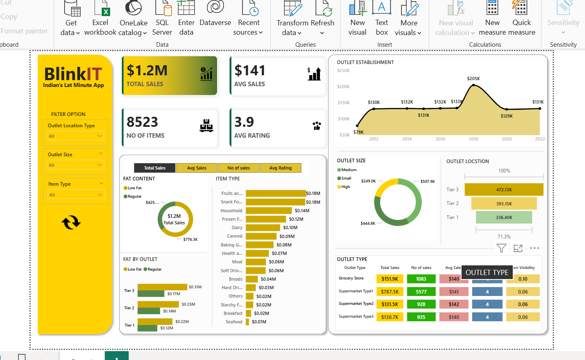
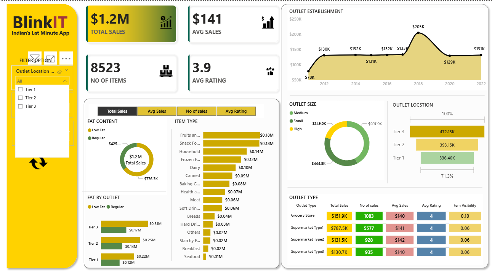
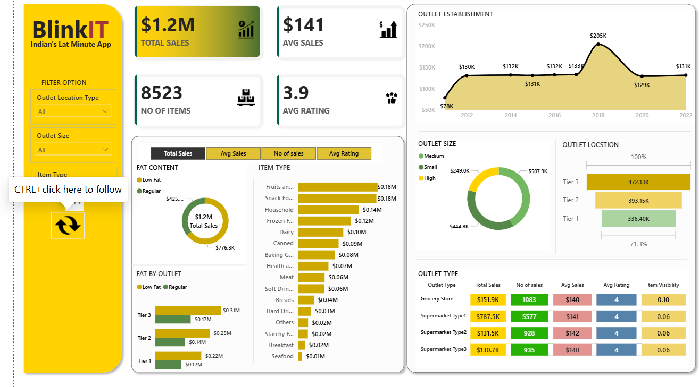
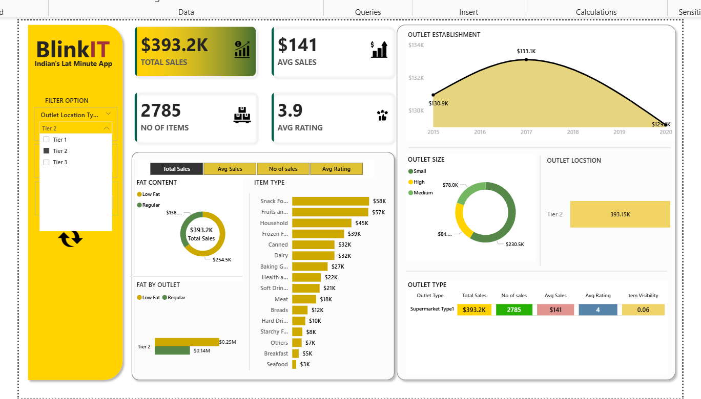

# BlinkIT-Sales-Dashboard-PowerBI
## Project Overview
This project involves the development of a comprehensive **Power BI Dashboard** for Blinkit to analyze sales performance. I transformed raw data into actionable insights regarding revenue trends, customer satisfaction, and outlet efficiency.

## Key Insights
* **Total Sales:** $1.2M
* **Average Sales:** $141
* **Number of Items:** 8,523
* **Average Rating:** 3.9/5.0
* **Top Performance:** Analyzed sales distribution across **Tier 1, 2, and 3** locations.

## Technical Skills Used
* **Data Cleaning:** Power Query
* **Advanced Analytics:** DAX (Data Analysis Expressions)
* **Data Modeling:** Relational Star Schema
* **Visualization:** Area Charts, Donut Charts, and Heat Maps

## Dashboard Previews

